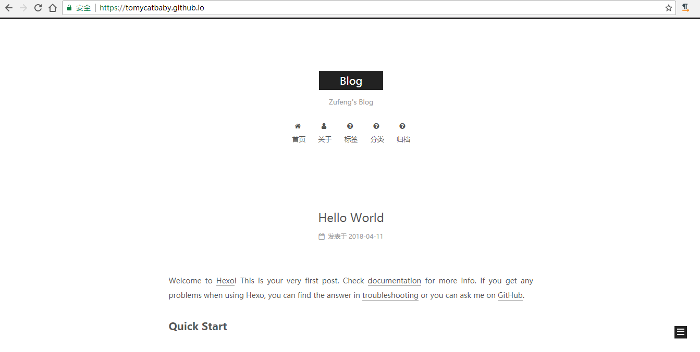

---
title: Hexo之NexT主题搭建博客踩过的坑
date: 2018-4-01 15:39:31
categories: hexo             # 分类
tags: [nodejs, hexo]   # [标签1, 标签2..., 标签n]
---
<div>
	<center>
		<iframe frameborder="no" border="0" marginwidth="0" marginheight="0" width=330 height=86 src="//music.163.com/outchain/player?type=2&id=863046037&auto=0&height=66"></iframe>
	</center>
</div>
hexo+github搭建博客，自己也是拾前人牙慧，花了一天时间解决各种问题，本来很简单的问题也是在摸索中花费了大量时间，想起来就很搞笑，不过到底是解决了，好了，想要去看比较详细的过程就去: [VOLC](http://volcfamily.cn/2016/10/03/Hexo%E4%B9%8BNexT%E4%B8%BB%E9%A2%98%E6%90%AD%E5%BB%BA%E5%8D%9A%E5%AE%A2%E8%AF%A6%E7%BB%86%E8%BF%87%E7%A8%8B/)这个博客吧，写的够详细了，下面写我踩过的坑吧。

## 遇到的问题

### 1.图标问题
新版的hexo不需要在menu_icons中用key-value方式为menu添加图标，在菜单项menu（名称和链接）加 || FontAwesome icon的name

```
menu:
  home: / ||home
  categories: /categories ||th
  archives: /archives ||archive
  tags: /tags ||tags
  message: /message ||external-link  
  about: /about ||user
  #commonweal: /404.html

# Enable/Disable menu icons.
menu_icons:
  enable: true

```
### 2.头像问题
在blog/source文件夹下新建img文件夹，将你的头像图片放进去，在站点文件_config.yml中修改

```
# 设置头像
avatar: img/hg.jpeg

```
### 3.在博文中添加图片
1.把主页配置文件_config.yml 里的post_asset_folder:这个选项设置为true
2.在你的hexo目录下执行这样一句话npm install hexo-asset-image --save，这是下载安装一个可以上传本地图片的插件
3 最后在xxxx.md中想引入图片时，先把图片复制到source/_posts/xxxx这个文件夹中，然后只需要在xxxx.md中按照markdown的格式引入图片：

```

```
### 4.本地项目托管到github
首先在你的github中new一个新的代码仓库，name：{your blog's name}.github.io

> 修改站点文件

```
# Deployment
## Docs: https://hexo.io/docs/deployment.html
deploy:
  type: git
  repo: git@github.com:tomycatbaby/tomycatbaby.github.io.git
  branch: master
```
> 验证是否能否连接到github
```
$ ssh -T git@github.com

```
成功后
```
Hi zhangsan! You've successfully authenticated, but GitHub does not provide shell access.
```
> 上传代码 中间会输入github密码

```
hexo -d
```
> 成功后就可以用 http://tomycatbaby.github.io 访问了

